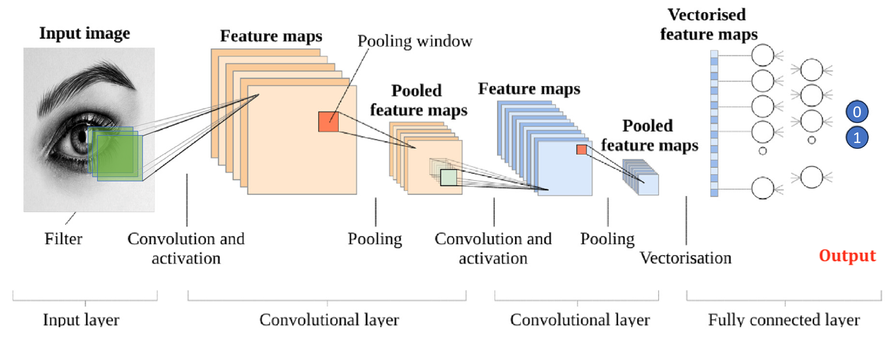
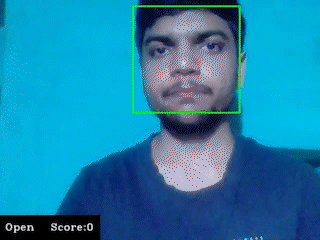

# **Driver Alert system using Deep Learning.**

### Objectives:
*	Develop a driver alert system to prevent reckless driving by detecting driver sleepiness and alerting them. 
*	Implemented Alerting features: Playing an ***'alarm'*** sound, sendind ***'SMS'*** and ***'Call'*** to inform the driver's family.
*	Utilize deep learning CNN model to classify ***'sleepiness'*** based on eye images and monitor eye status (open/close). 
*	It can provide an integrated solution for controlling speed and braking for safer driving.

# **1. Dataset Selection**

Dataset for this project is taken from [MRL Eye Dataset](http://mrl.cs.vsb.cz/eyedataset). Which contains around 84,0000 images of open and close eyes.

Motivation behind selecting this dataset is that this dataset is collected from 37 different countries people with different conditions such as with and without eyeglasses, and in day and night situation.

This Dataset will make the Model more robust to real world variation.

   
   

### Data processing 
(Refer [image_processing.py](image_processing.py) file) 
Images is in the data data are processed using opencv library. These are resized to same size of 64x64 dimensions.

**Label**:  Label of an image was extracted from file name.[0 for close Eye, 1 for open Eye]

 

# **2. Image Classification: Convolutional Neural Network**
(Refer [model training and evaluation.ipynb](model%20training%20and%20evaluation.ipynb) notebook)

1.	Convolutional Layers: Capture local patterns and features from the input data.

2.	Fully Connected Layers: Perform high-level reasoning on the extracted features and predict decisions

**Metric**: Accuracy (Percent of Correct Predictions)

**Loss Function**: Binary Cross Entropy 
 $= - \frac{1}{n}\sum{^{n}_{i=1}}({{y_i}.{log({y'_i})}} + (1-{y_i}).log{(1-{y'}_i)})$
 
**Activation Functions**:  Relu (for Internal Layers), Sigmoid (for Output Layer)
 

*<h3>Model Architecture</h3>*
Model Architecture is provide in [model_architecture.py](model_architecture.py)

## **Results**

 

### **Train Result**:
Loss:  0.0552, &nbsp;
Accuracy : 0.9867

### **Test Result**:
Loss:  0.0872, &nbsp;
Accuracy : 0.9618

**Precision**: $(\frac{True Positive}{True Positive+False Positive})$ , &nbsp; &nbsp; 0.97(close eye), &nbsp; 0.96(open eye)

**Recall**: $(\frac{True Positive}{True Positive+False Negetive})$ , &nbsp; &nbsp; 0.96(close eye), &nbsp; 0.97(open eye)

**F1 score**: $(\frac{2Precision.Recall}{Precision+Recall})$ , &nbsp; &nbsp; 0.96(close eye), &nbsp; 0.96(open eye) 

 **Confusion matrix:**  &nbsp; &nbsp; 

 

# **3. Testing of 'Live Video' using *OpenCV* library**
(Refer [live testing.ipynb](live%20testing.ipynb) notebook)

Model is tested on Video with the help of *opencv* library (refer  notebook)
* Each frame obtained from the live video input undergoes face and subsequent eyes detection using *\`haar-cascade\`* classifiers.
* The eye status is predicted by passing each frame through our classification model.

* The ***"Score"*** variable increases while eyes are open, and decrements when eyes are closed.
* When score crosses the threshold, an *"Alarm"* is triggered.
* If sleepiness is detected multiple times, an "*SMS*" and voice "*Call*" are sent to the user's family member using \`**Twilio API**\`. 

&nbsp;&nbsp;&nbsp;&nbsp;&nbsp;&nbsp;&nbsp;
 
Call and SMS from Twilio Account

 ${θ'} = {θ} - \left({LearningRate}\right)\frac{∂J}{∂θ}$, &nbsp;&nbsp; $\frac{∂J}{∂θ} = \frac{1}{m}\sum_{i = 1}^{m} \left({y'}-{y}\right)\left(\frac{∂y'}{∂θ}\right)$

$\frac{∂y'}{∂min} = \left(\frac{max - y'}{max-min}\right)$, &nbsp; &nbsp;
$\frac{∂y'}{∂min} = \left(\frac{y'- min}{max-min}\right)$

$\frac{∂y'}{∂SoS} = \left({GrowthRate}\right)\left({max- min}\right)\left({σ1}\right)\left({1-σ1}\right)$, &nbsp;&nbsp;
$\frac{∂y'}{∂EoS} = -\left({DecayRate}\right)\left({max- min}\right)\left({σ2}\right)\left({1-σ2}\right)$ 

$\frac{∂y'}{∂GrowthRate} = -\left({DoY - SoS}\right)\left({max- min}\right)\left({σ1}\right)\left({1-σ1}\right)$, &nbsp;&nbsp;
$\frac{∂y'}{∂DecayRate} = \left({DoY -EoS}\right)\left({max- min}\right)\left({σ2}\right)\left({1-σ2}\right)$ 

